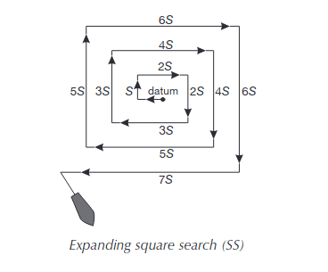
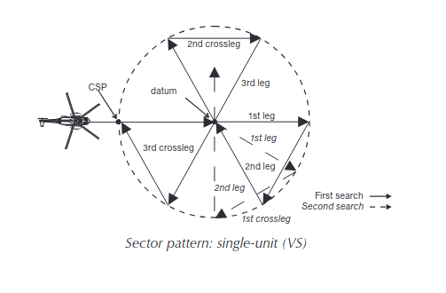

# Search and Rescue simulations
This project uses PX4 SITL together with the MAVLink 2 communication protocol to simulate and evaluate search-and-rescue flight patterns for multicopter UAVs. The system generates autonomous waypoints and executes sector searches, expanding patterns, and other SAR-relevant geometries within a fully simulated PX4 environment.
## Pre-requisties
- QGroundControl installed and running
- PX4 SITL configured with a single multicopter airframe
- Python 3 environment with required dependencies installed
- pymavlink

## Runtime
Execute the main script\\
    ```
    main.py
    ``` 
    \\
Ensure PX4 SITL is running before launching script to allow MAVLink connections


## Search patterns
The following search patterns are implemented and evaluated in this project:
### Expanding Box

An expanding box search covers an area by flying a square pattern that increases in size with each loop.  
It is typically used when the last known position of the target is accurate, and environmental drift (wind or current) is minimal.

### Sector Search

A sector search divides the area around a datum into equal angular sectors.  
The UAV flies out and back along each sector, providing repeated passes over the highest-probability location.  


### References
Search pattern definitions and descriptions are based on the methods described in: https://owaysonline.com/iamsar-search-patterns/
